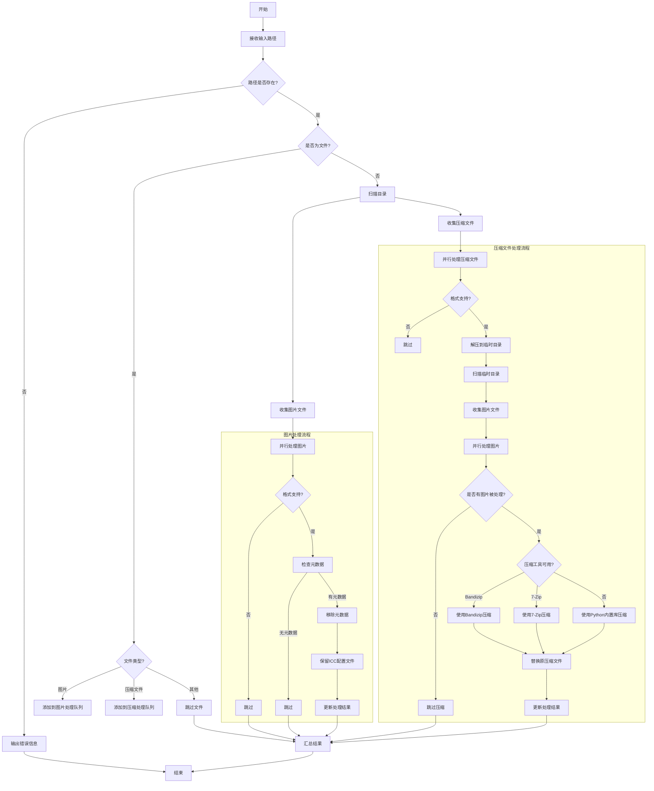

# image_metadata_remover

批量移除图片文件与压缩包内的图片文件的元数据的工具。

## 功能特性

- 🔍 **批量处理**：支持处理单个图片、单个压缩文件或整个目录
- 📦 **压缩文件支持**：自动处理ZIP压缩包内的图片
- 🔄 **并行处理**：使用多线程提高处理效率
- 📊 **详细统计**：提供处理结果统计和体积变化信息
- 🛡️ **安全处理**：保留ICC配置文件，不破坏图片质量
- ⚡ **智能跳过**：自动跳过不支持的格式和无元数据的文件
- 📝 **线程安全输出**：确保多线程环境下的输出正确性

> [工作流程图](#工作流程图)

## 跨平台支持

仅在Windows 11 x64 2402版本测试过。

理论上兼容linux-x86_64、linux-aarch64、macos-x86_64、macos-arm64，但未经实际测试，欢迎这些平台的用户尝试，并在Issue中讨论。

## 支持的文件格式

### 图片格式
- JPEG (.jpg, .jpeg)
- PNG (.png)
- WebP (.webp)

### 压缩文件格式
- ZIP (.zip)

## 安装说明

Release中提供经过Nuitka打包的单exe文件，保留了控制台窗口，Windows用户可以直接下载使用。

### 1. 安装Python

确保您的系统已安装Python 3.8或更高版本。您可以从[Python官网](https://www.python.org/)下载并安装。

### 2. 克隆或下载项目

将项目文件下载到您的本地目录。

### 3. 创建虚拟环境

```bash
# Windows
python -m venv .venv

# macOS/Linux
python3 -m venv .venv
```

### 4. 激活虚拟环境

```bash
# Windows
.venv\Scripts\activate

# macOS/Linux
source .venv/bin/activate
```

### 5. 安装依赖

只为使用本工具，而无打包需求，只需pip安装pyexiv2：

```bash
pip install pyexiv2
```

⚠️ **重要提醒**：使用pyexiv2库必须安装Microsoft Visual C++ Redistributable for Visual Studio 2022。

[From LeoHsiao1/pyexiv2 ：在 Windows 上使用 pyexiv2 时](https://github.com/LeoHsiao1/pyexiv2/blob/97dfd409890fca21bc937524f3360e02c1047ec4/docs/Tutorial-cn.md?plain=1#L58)

您可以从[https://aka.ms/vs/17/release/vc_redist.x64.exe](https://aka.ms/vs/17/release/vc_redist.x64.exe)下载并安装。

## 使用方法

## 注意事项

1. 建议在处理前备份重要图片文件，建议不要处理包含重要元数据的图片，因为处理后元数据会被移除且无法恢复。
2. 压缩文件处理时会优先使用Bandizip，其次是7-Zip，最后使用Python内置库。
3. 处理压缩文件时，会创建临时文件，处理完成后自动清理。
4. 确保有足够的磁盘空间用于处理压缩文件。

### 基本使用

建议使用双引号`" "`包裹路径，避免空格导致的问题。

```bash
# 处理单个图片文件
python image_metadata_remover.py "image.jpg"

# 处理整个目录（递归）
python image_metadata_remover.py "./images_path"

# 处理整个目录（非递归）
python image_metadata_remover.py "./images_path" --non-recursive

# 处理压缩文件
python image_metadata_remover.py "archive.zip"
```

### 命令行参数

```
usage: image_metadata_remover.py [-h] [--non-recursive] [--max-workers MAX_WORKERS] path

图片元数据移除工具

positional arguments:
  path                  要扫描的目录或文件路径

options:
  -h, --help            show this help message and exit
  --non-recursive       不递归扫描子目录
  --max-workers MAX_WORKERS
                        最大工作线程数，默认使用CPU核心数
```

## 依赖库

- **pyexiv2**：用于读取和修改图片元数据

## 压缩工具安装建议

虽然工具可以使用Python内置库处理压缩文件，但安装专业压缩工具可以获得更好的压缩效果和性能。

### Bandizip

1. **下载地址**：[Bandizip官网](https://www.bandisoft.com/bandizip/)
2. **安装路径建议**：
   - Windows 64位：`C:\Program Files\Bandizip`
   - Windows 32位：`C:\Program Files (x86)\Bandizip`
3. **安装选项**：建议勾选"添加到PATH"选项，便于工具自动检测

### 7-Zip

1. **下载地址**：[7-Zip官网](https://www.7-zip.org/)
2. **安装路径建议**：
   - Windows 64位：`C:\Program Files\7-Zip`
   - Windows 32位：`C:\Program Files (x86)\7-Zip`
3. **安装选项**：默认安装即可，工具会自动检测7-Zip路径

### 优先级说明

工具会按照以下优先级使用压缩工具：
1. **Bandizip** - 提供最佳的压缩效果和速度
2. **7-Zip** - 提供高压缩率
3. **Python内置库** - 兼容性最好，但压缩效果和速度一般


## 为什么选择pyexiv2作为移除元数据的工具？

pyexiv2可以处理多种元数据格式，包括EXIF、IPTC、XMP、注释和缩略图，提供更全面的元数据控制和更高的处理效率。

尝试过Pillow，但在实践中发现其偶尔会导致图片文件被体积意外增大，若是设置较低的jpg导出质量又可能存在图像被批量劣化的问题，这对某些用户来说是不可接受的。

pyexiv2的元数据移除功能经过测试不会损伤图片质量，或导致图片文件被体积意外增大。

GitHub页面：[https://github.com/LeoHsiao1/pyexiv2](https://github.com/LeoHsiao1/pyexiv2)

## 工作流程图



## 贡献、问题、意见

欢迎提交Issue和Pull Request！

如有问题或建议，请通过GitHub Issues反馈。
